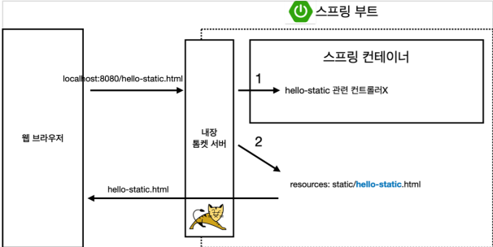
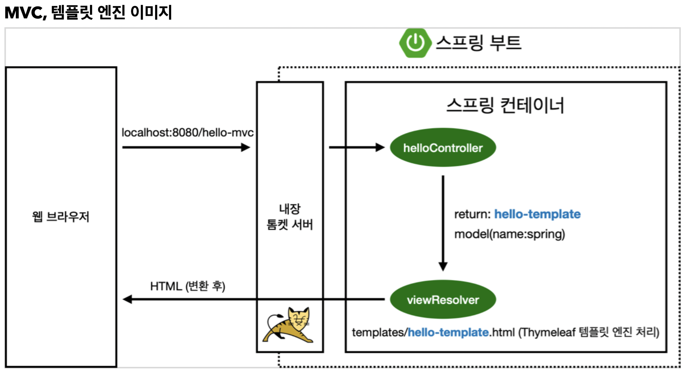

## 스프링 웹 개발 기초
- 정적 컨텐츠  
고정된 페이지를 보냄
- MVC와 템플릿 엔진  
페이지를 서버에서 수정하여 보냄
- API  
브라우저가 아닌 다른 플랫폼에 JSON등의 방식으로 데이터를 보냄

### 정적 컨텐츠
- 스프링 부트 정적 컨텐츠 기능  
- src/resoureces/static 폴더의 html파일 제공  
http://localhost:8080/static.html => static.html을 보냄  
  

### MVC와 템플릿 엔진
- MVC: Model, View, Controller

**Controller**

```java:HelloController
@Controller
public class HelloController {
	@GetMapping("hello-mvc")
	public String helloMvc(@RequestParam("name") String name, Model model) {
		model.addAttribute("name", name);
		return "hello-template";
	}
}
```
**View**
```resoureces/template/hello-template.html```
```html
<html xmlns:th="http://www.thymeleaf.org">
<body>
<p th:text="'hello ' + ${name}">hello! empty</p>
</body>
</html>
```

