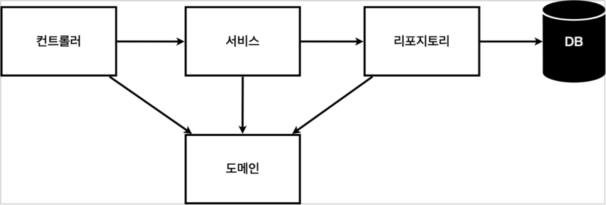
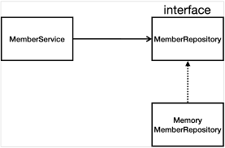
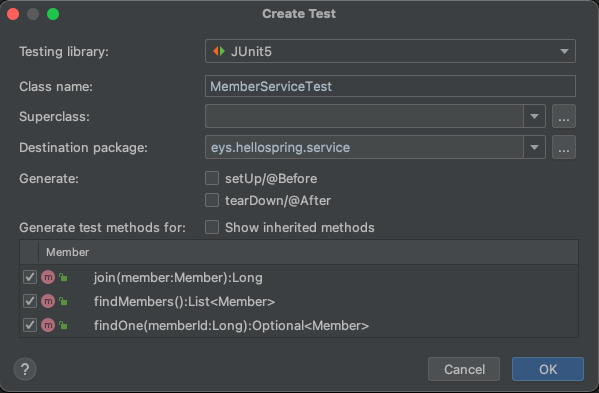

## 회원 관리 예제
- [비즈니스 요구사항 정리](비즈니스-요구사항-정리)
- [회원 도메인과 리포지토리 만들기](회원-도메인과-리포지토리-만들기)
- [회원 리포지토리 테스트 케이스 작성](회원-리포지토리-테스트-케이스-작성)
- [회원 서비스 개발](회원-서비스-개발)
- [회원 서비스 테스트](회원-서비스-테스트)

### 비즈니스 요구사항 정리
**예제이므로 최소한의 정보와 기능만 다룸**
- 데이터: 회원ID, 이름  
- 기능: 회원 등록, 조회
- 아직 데이터 저장소가 선정되지 않음 (가상의 시나리오)

#### 일반적인 웹 애플리케이션 계층 구조


- 컨트롤러: 웹 MVC의 컨트롤러 역할
- 서비스: 핵심 비즈니스 로직 구현
- 리포지토리: 데이터베이스에 접근, 도메인 객체를 DB에 저장하고 관리
- 도메인: 비즈니스 도메인 객체, 예) 회원, 주문, 쿠폰 등등 주로 데이터베이스에 저장하고 관리됨  

**예제도 위의 일반적인 웹 애플리케이션 계층 구조를 따라감**

#### 클래스 의존 관계


- 아직 데이터 저장소가 선정되지 않아서, 우선 인터페이스로 구현 클래스를 변경할 수 있도록 설계
- 데이터 저장소는 RDB, NoSQL 등등 다양한 저장소를 고민 중인 상황으로 가정
- 개발을 진행하기 위해서 초기 개발 단게에서는 구현체로 가벼운 메모리 기반의 데이터 저장소 사용

### 회원 도메인과 리포지토리 만들기
**회원 객체**
```java
package eys.hellospring.domain;

public class Member {

    // UUID, not user id
    private Long id;
    private String name;

    public Long getId() {
        return id;
    }

    public void setId(Long id) {
        this.id = id;
    }

    public String getName() {
        return name;
    }

    public void setName(String name) {
        this.name = name;
    }
}

```
**회원 리포지토리 인터페이스**
```java
package eys.hellospring.repository;

import eys.hellospring.domain.Member;

import java.util.List;
import java.util.Optional;

public interface MemberRepository {
    Member save(Member member);
	// null을 반환할 가능성이 있으면 Optional로 감싸준다.
	// 만약 null을 반환하면 프론트엔드에서 처리한다.
    Optional<Member> findById(Long id);
    Optional<Member> findByName(String name);
    List<Member> findAll();
}

```
**회원 리포지토리 메모리 구현체**
```java
package eys.hellospring.repository;

import eys.hellospring.domain.Member;

import java.util.*;

public class MemoryMemberRepository implements MemberRepository {

    private static Map<Long, Member> store = new HashMap<>();
    private static long sequence = 0L;

    @Override
    public Member save(Member member) {
        member.setId(++sequence);
        store.put(member.getId(), member);
        return member;
    }

    @Override
    public Optional<Member> findById(Long id) {
        return Optional.ofNullable(store.get(id));
    }

    @Override
    public Optional<Member> findByName(String name) {
        store.values().stream()
                .filter(member -> member.getName().equals(name))
                .findAny();
    }

    @Override
    public List<Member> findAll() {
        return new ArrayList<>(store.values());
    }
}

```

### 회원 리포지토리 테스트 케이스 작성
개발한 기능을 실행해서 테스트할 때 자바의 Main 메서드를 통해서 실행하거나, 웹 애플리케이션의 컨트롤러를 통해서 해당 기능을 실행한다. 이러한 방법은 시간이 오래 걸리고 여러번 테스트하기 어려우므로 자바는 JUnit이라는 프레임워크로 테스트를 실행해서 이러한 문제를 해결한다.

`src/text/java` 하위 폴더에 생성   
```java:MemoryMemberRepositoryText
package eys.hellospring.repository;

import eys.hellospring.domain.Member;
import org.assertj.core.api.Assertions;
import org.junit.jupiter.api.AfterEach;
import org.junit.jupiter.api.Test;

class MemoryMemberRepositoryTest {

    MemoryMemberRepository repository = new MemoryMemberRepository();

	// 각 테스트가 끝난 이후에는 메모리(저장소)를 비워준다.
    @AfterEach
    public void afterEach() {
        repository.clearStore();
    }

    @Test
    public void save() {
        Member member = new Member();
        member.setName("spring");

        repository.save(member);

        Member result = repository.findById(member.getId()).get();
        Assertions.assertThat(member).isEqualTo(result);
    }
}

```


### 회원 서비스 개발
```java:MemberService
package eys.hellospring.service;

import eys.hellospring.domain.Member;
import eys.hellospring.repository.MemberRepository;
import eys.hellospring.repository.MemoryMemberRepository;

import java.util.List;
import java.util.Optional;

public class MemberService {

    private final MemberRepository memberRepository = new MemoryMemberRepository();

    // 회원가입
    public Long join(Member member) {
        // 같은 이름이 있는 중복 회원X
        validateDuplicateMember(member);

        memberRepository.save(member);
        return member.getId();
    }

    private void validateDuplicateMember(Member member) {
        memberRepository.findByName(member.getName())
                .ifPresent(m -> {
                    throw new IllegalStateException("이미 존재하는 회원입니다.");
                });
    }

    // 전체 회원 조회
    public List<Member> findMembers() {
        return memberRepository.findAll();
    }

    public Optional<Member> findOne(Long memberId) {
        return memberRepository.findById(memberId);
    }
}
```

### 회원 서비스 테스트 케이스 생성
회원 리포지토리 테스트 케이스를 생성할 때는 직접 만들어줬지만 단축키를 사용하면 편하다.
`cmd + shift + t`

