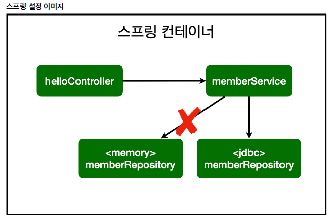

## 스프링 DB 접근 기술
### H2 데이터베이스 설치

<p>H2: 개발이나 테스트 용도로 가볍고 편리한 DB, 웹 화면 제공</p>

- [https://www.h2database.com]  
- 다운로드 및 설치  
- h2의 bin폴더에 가서 권한주기  
`chmod 755 h2.sh`
- 실행  
`./h2.sh`
- 데이터베이스 파일 생성 방법  
   - `jdbc:h2:~/test` (최초 한번)
   - `~/test.mv.db`파일 생성 확인
   - 이후부터는 `jdbc:h2:tcp://localhost/~/test`로 접속

### 테이블 생성
테이블 관리를 위해 프로젝트 루트에 `sql/ddl.sql` 생성
```sql:ddl.sql
drop table if exists member CASCADE;
create table member
(
 id bigint generated by default as identity,
 name varchar(255),
 primary key (id)
);
```
데이터베이스에 접근해서 `member` 테이블 생성

### 순수 Jdbc

jdbc, h2를 사용하기 위해 관련 라이브러리를 **build.gradle** 에 추가한다.
```gradle
implementation 'org.springframework.boot:spring-boot-starter-jdbc'
runtimeOnly 'com.h2database:h2'
```

스프링부트 데이터베이스 연결 설정 추가  
`resources/applicatoin.properties`
```
spring.datasource.url=jdbc:h2:tcp://localhost/~/test
spring.datasource.driver-class-name=org.h2.Driver
spring.datasource.username=sa
```
> **주의** : 스프링 2.4부터는 `spring.datasource.username=sa`를 꼭 추가해주어야 한다. 그렇지 않으면 `Wrong user name or password` 오류가 발생한다. 또한 뒤에 공백이 들어가도 같은 오류가 들어간다.

### Jdbc 리포지토리 구현
이렇게 JDBC API로 직접 코딩하는 것은 20년 전 이야기이다. 최근에는 ORM 등을 사용한다.

**JdbcMemberRepository.java**
```java:JdbcMemberRepository.java
package eys.hellospring.repository;
import eys.hellospring.domain.Member;
import org.springframework.jdbc.datasource.DataSourceUtils;
import javax.sql.DataSource;
import java.sql.*;
import java.util.ArrayList;
import java.util.List;
import java.util.Optional;
public class JdbcMemberRepository implements MemberRepository {
    private final DataSource dataSource;
    public JdbcMemberRepository(DataSource dataSource) {
        this.dataSource = dataSource;
    }
    @Override
    public Member save(Member member) {
        // 디비에서 실행시킬 쿼리문
        String sql = "insert into member(name) values(?)";
        Connection conn = null;
        PreparedStatement pstmt = null;
        ResultSet rs = null;
        try {
            // 커넥션 생성
            conn = getConnection();
            pstmt = conn.prepareStatement(sql,
                    Statement.RETURN_GENERATED_KEYS);
            pstmt.setString(1, member.getName());
            pstmt.executeUpdate();
            rs = pstmt.getGeneratedKeys();
            if (rs.next()) {
                member.setId(rs.getLong(1));
            } else {
                throw new SQLException("id 조회 실패");
            }
            return member;
        } catch (Exception e) {
            throw new IllegalStateException(e);
        } finally {
            close(conn, pstmt, rs);
        }
    }
    @Override
    public Optional<Member> findById(Long id) {
        String sql = "select * from member where id = ?";
        Connection conn = null;
        PreparedStatement pstmt = null;


        ResultSet rs = null;
        try {
            conn = getConnection();
            pstmt = conn.prepareStatement(sql);
            pstmt.setLong(1, id);
            rs = pstmt.executeQuery();
            if(rs.next()) {
                Member member = new Member();
                member.setId(rs.getLong("id"));
                member.setName(rs.getString("name"));
                return Optional.of(member);
            } else {
                return Optional.empty();
            }
        } catch (Exception e) {
            throw new IllegalStateException(e);
        } finally {
            close(conn, pstmt, rs);
        }
    }
    @Override
    public List<Member> findAll() {
        String sql = "select * from member";
        Connection conn = null;
        PreparedStatement pstmt = null;
        ResultSet rs = null;
        try {
            conn = getConnection();
            pstmt = conn.prepareStatement(sql);
            rs = pstmt.executeQuery();

            List<Member> members = new ArrayList<>();
            while(rs.next()) {
                Member member = new Member();
                member.setId(rs.getLong("id"));
                member.setName(rs.getString("name"));
                members.add(member);
            }
            return members;
        } catch (Exception e) {
            throw new IllegalStateException(e);
        } finally {
            close(conn, pstmt, rs);
        }
    }
    @Override
    public Optional<Member> findByName(String name) {
        String sql = "select * from member where name = ?";
        Connection conn = null;
        PreparedStatement pstmt = null;
        ResultSet rs = null;
        try {
            conn = getConnection();
            pstmt = conn.prepareStatement(sql);
            pstmt.setString(1, name);
            rs = pstmt.executeQuery();
            if(rs.next()) {
                Member member = new Member();
                member.setId(rs.getLong("id"));
                member.setName(rs.getString("name"));
                return Optional.of(member);
            }
            return Optional.empty();
        } catch (Exception e) {
            throw new IllegalStateException(e);
        } finally {
            close(conn, pstmt, rs);
        }
    }
    private Connection getConnection() {
        return DataSourceUtils.getConnection(dataSource);
    }
    private void close(Connection conn, PreparedStatement pstmt, ResultSet rs)
    {
        try {
            if (rs != null) {
                rs.close();
            }
        } catch (SQLException e) {
            e.printStackTrace();
        }
        try {
            if (pstmt != null) {
                pstmt.close();
            }
        } catch (SQLException e) {
            e.printStackTrace();
        }
        try {
            if (conn != null) {
                close(conn);
            }
        } catch (SQLException e) {
            e.printStackTrace();
        }
    }
    private void close(Connection conn) throws SQLException {
        DataSourceUtils.releaseConnection(conn, dataSource);
    }
}
```

MemoryMemberRepository 대신 JdbcMemberRepository를 사용하기 위해 SpringConfig를 수정한다.
**SpringConfig.java**
```java:SpringConfig.java
@Configuration
public class SpringConfig {

    private final DataSource datasource;

    @Autowired

    public SpringConfig(DataSource datasource) {
        this.datasource = datasource;
    }

    @Bean
    public MemberService memberService() {
        return new MemberService(memberRepository());
    }

    @Bean
    public MemberRepository memberRepository() {
        return new JdbcMemberRepository(datasource);
    }
}

```
- DataSource는 데이터베이스 커넥션을 얻을 때 사용하는 객체이다. 스프링 부트는 데이터베이스 커넥션 정보를 바탕으로 DataSource를 생성하고 스프링 빈으로 만들어둔다. 그래서 DI를 받을 수 있다.

**스프링 설정 이미지**  


- 개방-폐쇄 원칙 (OCP, Open-Closed Principle)
   - 확장에는 열려있고, 수정, 변경에는 닫혀 있다.
- 스프링의 DI를 사용하면 기존 코드를 전혀 손대지 않고, 설정만으로 구현 클래스를 변경할 수 있다.

### 스프링 통합 테스트
스프링 컨테이너와 DB까지 연결된 통합 테스트를 진행해보자.

**MemberServiceIntegrationTest.java**
```java:MemberServiceInterationTest.java
package eys.hellospring.service;

import eys.hellospring.domain.Member;
import eys.hellospring.repository.MemberRepository;
import eys.hellospring.repository.MemoryMemberRepository;
import org.junit.jupiter.api.AfterEach;
import org.junit.jupiter.api.BeforeEach;
import org.junit.jupiter.api.Test;
import org.springframework.beans.factory.annotation.Autowired;
import org.springframework.boot.test.context.SpringBootTest;
import org.springframework.transaction.annotation.Transactional;

import static org.assertj.core.api.Assertions.assertThat;
import static org.junit.jupiter.api.Assertions.assertThrows;

@SpringBootTest
@Transactional
class MemberServiceIntegrationTest {

    @Autowired MemberService memberService;
    @Autowired MemberRepository memberRepository;
//    MemberService memberService;
//    MemoryMemberRepository memberRepository;
//
//    @BeforeEach
//    public void beforeEach() {
//        memberRepository = new MemoryMemberRepository();
//        memberService = new MemberService(memberRepository);
//    }
//
//    @AfterEach
//    public void afterEach() {
//        memberRepository.clearStore();
//    }

    @Test
    void 회원가입() {
        // given
        Member member = new Member();
        member.setName("spring");

        // when
        Long saveId = memberService.join(member);

        // then
        Member findMember = memberService.findOne(saveId).get();
        assertThat(member.getName()).isEqualTo(findMember.getName());
    }
    @Test
    public void 중복_회원_예외() {
        // given
        Member member1 = new Member();
        member1.setName("spring");

        Member member2 = new Member();
        member2.setName("spring");

        // when
        memberService.join(member1);
        IllegalStateException e = assertThrows(IllegalStateException.class, () -> memberService.join(member2));

        assertThat(e.getMessage()).isEqualTo("이미 존재하는 회원입니다.");


//        try{
//            memberService.join(member2);
//            fail();
//        } catch (IllegalStateException e){
//            assertThat(e.getMessage()).isEqualTo("이미 존재하는 회원입니다.");
//        }

        // then
    }
    @Test
    void findMembers() {
    }

    @Test
    void findOne() {
    }
}
```

- `@SpringBootTest` : 스프링 컨테이너와 테스트를 함께 실행한다.
- `@Transactional` : 테스트 케이스에 이 Annotation이 있으면, 테스트 시작 전에 트랜잭션을 시작하고 테스트 완료 후에 항상 롤백한다. 트랜젝션을 하면 테스트 도중의 쿼리문은 디비에 반영되지 않으므로 다음 테스트에 영향을 주지 않는다. 따라서 주석처리 해놓은 `@BeforeEach`, `@AfterEach` Annotation이 더이상 필요하지 않다.
> 자바 코드로 최소한의 단위로 실행하는 테스트를 **단위 테스트**, 스프링 컨테이너나 디비를 연동하여 하는 테스트를 **통합 테스트**라 하는데, **순수한 단위 테스트가 더 좋은 테스트일 가능성이 높다.**
